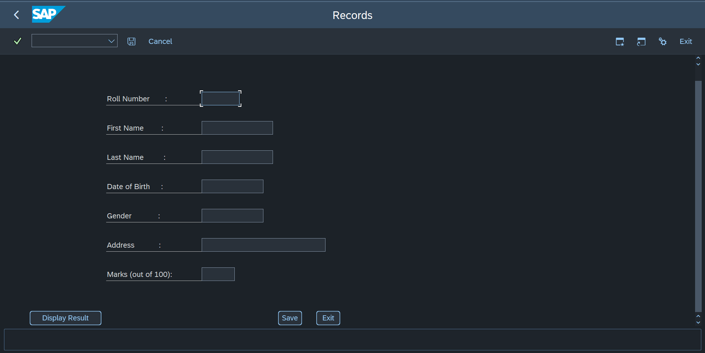

# Student Information Management and Ranking System

## Introduction
The Student Information Management and Ranking System is an SAP ABAP module pool program designed to manage student information. It provides a user-friendly interface for inputting, storing, and retrieving student data, including student names, IDs, email addresses, and GPAs.

## Features
- Input screen for entering student details (Name, ID, Email, GPA).
- Storage of student details in a database table.
- Output screen for displaying stored student information.
- Simple, user-friendly interface.

## Screenshots



## Prerequisites
- SAP NetWeaver Application Server ABAP
- SAP GUI

## Installation

1. *Clone the Repository:*
   ```sh
   git clone https://github.com/shreyakushw/Student-Information-Management-and-Ranking-System.git

2. *Create the Database Table:*
   - Open the SAP GUI and go to transaction SE11.
   - Create a table named ZSTU20_TABLE1 with the following fields:
     - ROLLNO (Student ID)
     - FIRSTNAME (Student Name)
     - LASTNAME
     - DOB (Student DOB)
     - ADDRESS (address of the Student)
     - MARKS 
   - Activate the table.

3. *Create the Program and Includes:*
   - Open the SAP GUI and go to transaction SE80.
   - Create a module pool program named SAPMZ____1.
   - Create the following includes and add the respective code:
     - ZABC1TOP for global data.
     - ZABC1O01 for PBO (Process Before Output) modules.
     - ZABC1I01 for PAI (Process After Input) modules.
     - ZABC1F01 for form routines.
